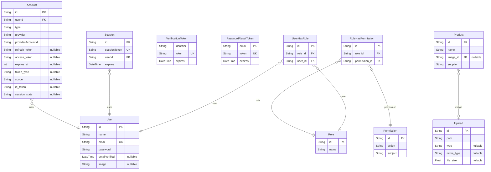

# Inventory System
> Generated by [`prisma-markdown`](https://github.com/samchon/prisma-markdown)

- [default](#default)

## default

### `Account`

**Properties**
  - `id`: 
  - `userId`: 
  - `type`: 
  - `provider`: 
  - `providerAccountId`: 
  - `refresh_token`: 
  - `access_token`: 
  - `expires_at`: 
  - `token_type`: 
  - `scope`: 
  - `id_token`: 
  - `session_state`: 

### `Session`

**Properties**
  - `id`: 
  - `sessionToken`: 
  - `userId`: 
  - `expires`: 

### `User`

**Properties**
  - `id`: 
  - `name`: 
  - `email`: 
  - `password`: 
  - `emailVerified`: 
  - `image`: 

### `VerificationToken`

**Properties**
  - `identifier`: 
  - `token`: 
  - `expires`: 

### `PasswordResetToken`

**Properties**
  - `email`: 
  - `token`: 
  - `expires`: 

### `Role`

**Properties**
  - `id`: 
  - `name`: 

### `Permission`

**Properties**
  - `id`: 
  - `action`: 
  - `subject`: 

### `RoleHasPermission`

**Properties**
  - `id`: 
  - `role_id`: 
  - `permission_id`: 

### `UserHasRole`

**Properties**
  - `id`: 
  - `role_id`: 
  - `user_id`: 

### `Product`

**Properties**
  - `id`: 
  - `name`: FAKE:faker.commerce.product()
  - `image_id`: 
  - `supplier`: FAKE:faker.company.name()

### `Upload`

**Properties**
  - `id`: 
  - `path`: 
  - `type`: 
  - `mime_type`: 
  - `file_size`: 